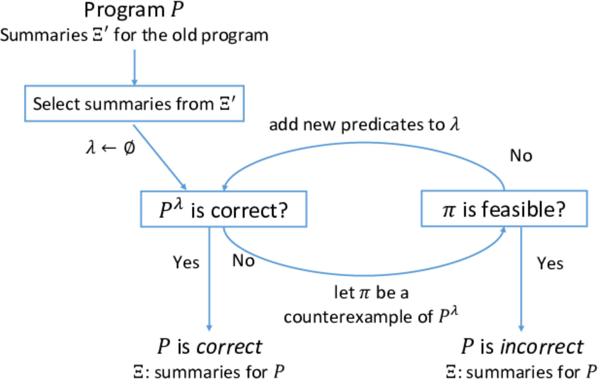
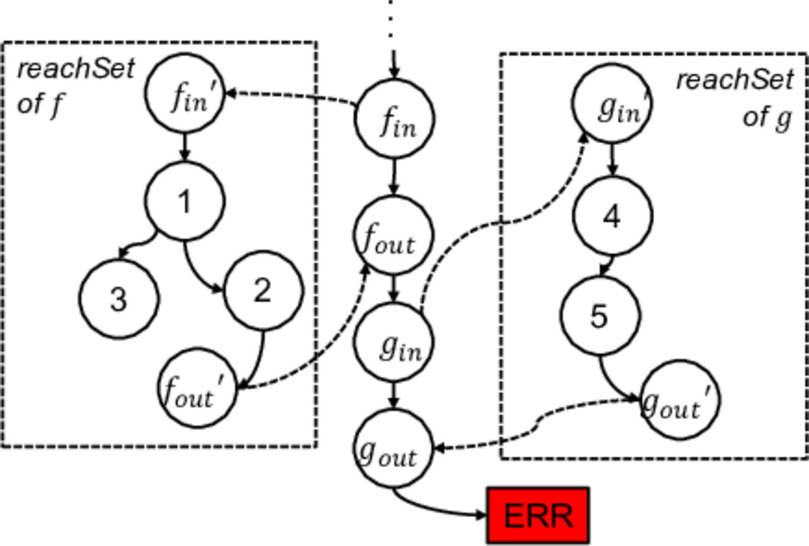

## 软件回归验证的摘要重用技术
### 贺飞、于千山、蔡历明
---

现代软件的开发已经不再是一蹴而就式，而是生长演化式的[1]。为了最大限度地满足客户的需求和适应应用的变化，软件在其生命周期内会频繁地被修改和不断推出新版本。新版本的软件会添加一些新的功能或者在软件功能上产生某些变化。随着软件的改变，软件的功能和应用接口以及软件的实现发生了演变。在原版本上已经证明的属性在新版本上可能变得不再成立。因此，需要在新版本软件上对属性重新进行验证。考虑到形式化验证耗费大量的计算资源，对每个版本执行独立的形式化验证不是一种有效的方法。如何适应于软件的持续改变与演化，开发高效的形式化验证技术具有重要意义。

设$$P$$和$$P'$$为程序的两个版本，$$\varphi$$为待验证属性，**回归验证**[2-6]就是在已经证 $$P\models\varphi$$（或者$$P\not\models\varphi$$）的基础上，验证$$P'$$是否满足$$\varphi$$。在验证$$P$$的过程中，除了最终结果外，还产生大量的中间结果（如可达状态集等）。这些中间结果对于$$P'$$的验证也是有用的。如果将这些中间结果记录下来，并且在后续软件版本的验证中进行重用，有望加速后续软件版本的验证过程。

过程间分析[7,8]是处理过程调用的一种分析手段。过程摘要是目前主流的一种过程间分析技术。其基本思想是在过程调用时，记录过程入口的前置条件和出口的后置条件（称为过程摘要）。假定所有已经记录的过程摘要都存储在摘要库中。对于新的过程调用，我们会先去摘要库中进行检索，确认是否存在一条前置条件被调用环境满足的摘要。如果存在，则不需要对这个过程再次执行分析，直接返回摘要中记录的后置条件。显然，利用过程摘要技术，可以大大减少冗余的过程分析，加快整体分析速度。

事实上，过程摘要[9]不仅可以用来加速单个程序版本的分析过程，也可以用来加快演化程序的分析过程。将新旧两个程序版本各看成为过程集合，即$$P=\{f_1,...,f_n\}$$, $$P'=\{f'_1,..., f'_m\}$$。然后依次对比$$P$$和$$P'$$中每一个过程的实现。如果存在一个过程$$f_i$$，使得$$f_i\equiv f'_i$$，则$$f_i$$上计算得到的过程摘要对于$$f'_i$$必然也成立。需要注意的有两点：1）为避免语义等价计算的复杂性，通常我们只在语法层面对比$$f_i$$和$$f'_i$$；2）如果过程$$f_i$$和$$f'_i$$中调用了其它过程，这个对比需要深入到这些被调用的过程之中。

上面给出了面向演化程序的摘要重用的最朴素的思想。在将这个想法应用到实际的程序验证框架中，还需要应对下面两个挑战：

- 众所周知，程序验证的关键是抽象。程序$$P$$一般是一个无限状态系统，无法直接被模型检测等技术验证。因此，必须找到一个合适的抽象精度$$\lambda$$，证明程序$$P$$在精度$$\lambda$$下的模型$$P^\lambda$$下的正确性。CEGAR（Counterexample-guided abstraction refinement）[10]是寻找合适抽象精度的、最经典的方法。如何将摘要重用的想法与CEGAR相结合，是我们需要应对的第一个挑战。通过应对这个挑战，我们实现了过程摘要在三个层面上，即不同过程调用之间（过程间分析技术已经实现）、不同抽象精度之间和不同程序版本之间的重用。

- 反例分析是CEGAR的核心步骤。如果程序验证在抽象精度$$\lambda$$下返回了一条反例$$\sigma$$，我们需要分析确认$$\sigma$$是否程序$$P$$的一条真实路径。如果是，则找到了一条真反例，验证结束；否则，称$$\sigma$$为伪反例，需要基于$$\sigma$$对当前抽象精度进行精化。注意$$\sigma$$是抽象模型$$P^\lambda$$上的一条抽象路径。在确认$$\sigma$$是否是程序的真实路径过程中，需要对$$\sigma$$中的所有过程调用进行展开，即获取$$\sigma$$在被调用过程中的路径片段。如果对应于这次过程调用的摘要是通过重用技术从上一个版本的程序验证中继承得到的，在展开过程中，我们将不得不利用程序分析重新计算它在被调用过程内部的路径片段。这从某种意义上抵消了摘要重用所带来的好处。为此，我们提出了一种惰性展开技术，尽可能减少此类计算。

最后，注意到循环摘要也是程序分析中的一种经典技术。区别于过程摘要，循环摘要可以减少进入循环体进行重复分析的次数，加快循环分析的速度。我们将循环摘要和过程摘要统称为程序摘要，并将上述框架进行扩展，以适用于所有程序摘要的重用。

{:width="600"} 

图1. 基于摘要重用的回归程序验证

 

{:width="600"}

图2. 反例分析中的过程调用展开

 基于CPAchecker工具实现了上述算法，并基于两个测试用例集对该方法进行实验验证：

- 真实测例集：由Dirk Beyer等人整理[5]，包含62个Linux驱动程序的1,119个真实演化版本；

- 人工测例集：我们根据SystemsDeviceDriversLinux64Reach-Safety category in SV-COMP’17整理，包含426个Linux驱动程序的2,556个程序版本（利用变异技术得到）。

实验结果验证了方法的有效性。在真实测例集上，我们的方法能够多解决216个验证任务，并且提速93.1%；在人工测例集上，我们的方法能够多解决10个验证任务，并且提速84.2%。

该工作已被IEEE Transactions on Software Engineering接受并预出版（doi: 10.1109/TSE.2020.3021477.）。

---
### 参考文献：

1. 国家自然科学基金委员会，可信软件基础研究重大研究计划建议书. 2007. 

   

2. B. Godlin and O. Strichman, “Regression verification,” in Proceedings of the 46th Annual Design Automation Conference. ACM, 2009, pp. 466–471.

3. J. Backes, S. Person, N. Rungta, and O. Tkachuk, “Regression verification using impact summaries,” in Model Checking Software. Springer, 2013, pp. 99–116.

4. M. Bohme, B. C. d. S. Oliveira, and A. Roychoudhury, “Partitionbased regression verification,” in Proceedings of the 2013 International Conference on Software Engineering. IEEE Press, 2013, pp. 302–311.

5. D. Beyer, S. Lowe, E. Novikov, A. Stahlbauer, and P. Wendler, “Precision reuse for efficient regression verification,” in Proceedings of the 2013 9th Joint Meeting on Foundations of Software Engineering. ACM, 2013, pp. 389–399.

6. S. K. Lahiri, K. L. McMillan, R. Sharma, and C. Hawblitzel,“Differential assertion checking,” in Proceedings of the 2013 9th Joint Meeting on Foundations of Software Engineering. ACM, 2013, pp. 345–355.

7. M. Sharir and A. Pnueli, Two approaches to interprocedural data flow analysis. New York University. Courant Institute of Mathematical Sciences. ComputerScience Department, 1978.

8. T. Reps, S. Horwitz, and M. Sagiv, “Precise Interprocedural dataflow analysis via graph reachability,” in Proceedings of the 22nd ACM SIGPLAN-SIGACT symposium on Principles of programming languages. ACM, 1995, pp. 49–61.

9. O. Sery, G. Fedyukovich, and N. Sharygina, “Incremental upgrade checking by means of interpolation-based function summaries,” in Formal Methods in Computer-Aided Design (FMCAD), 2012. IEEE, 2012, pp. 114–121.

10. E. Clarke, O. Grumberg, S. Jha, Y. Lu, and H. Veith, “Counterexample-guided abstraction refinement,” in Computer aided verification. Springer, 2000, pp. 154–169.

11. **Fei He, Qianshan Yu and Liming Cai, Efficient Summary Reuse for Software Regression Verification, IEEE Transactions on Software Engineering, 2020. Early Access. doi: 10.1109/TSE.2020.3021477.**

---

